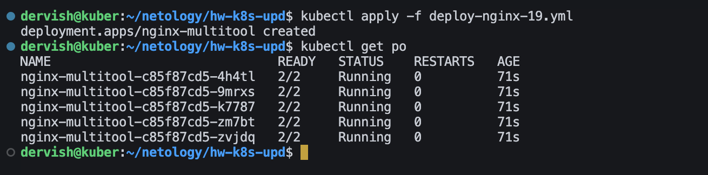
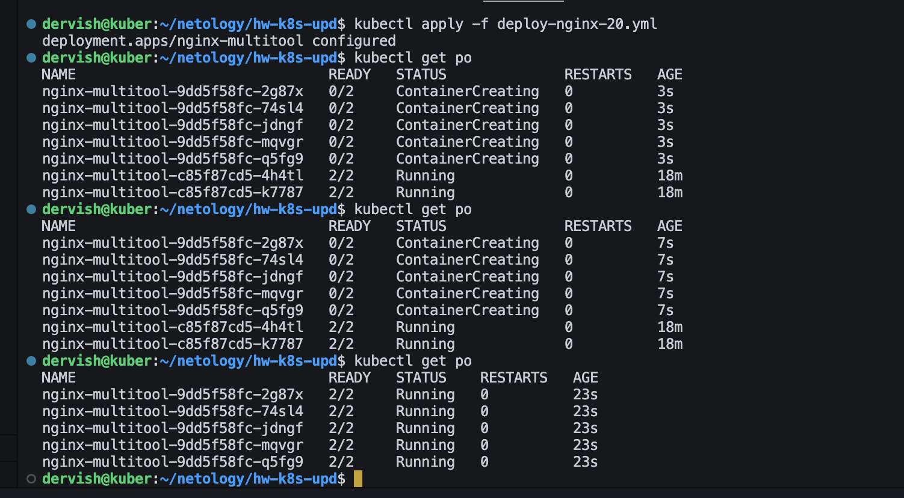
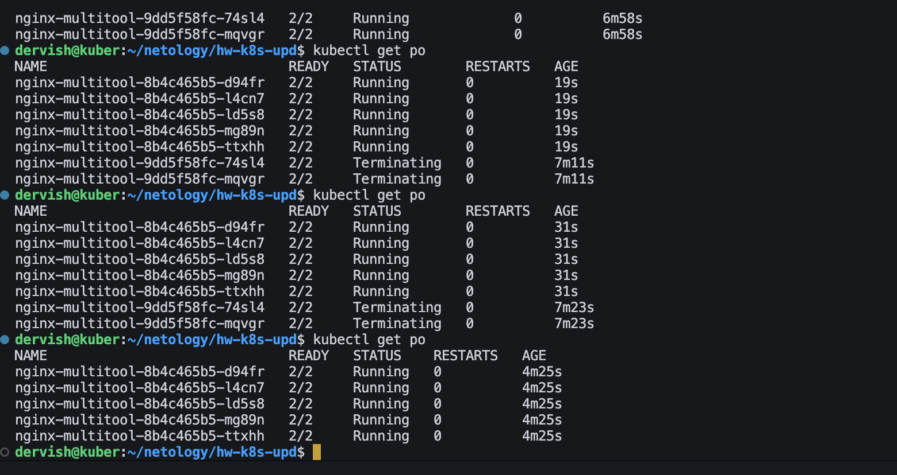
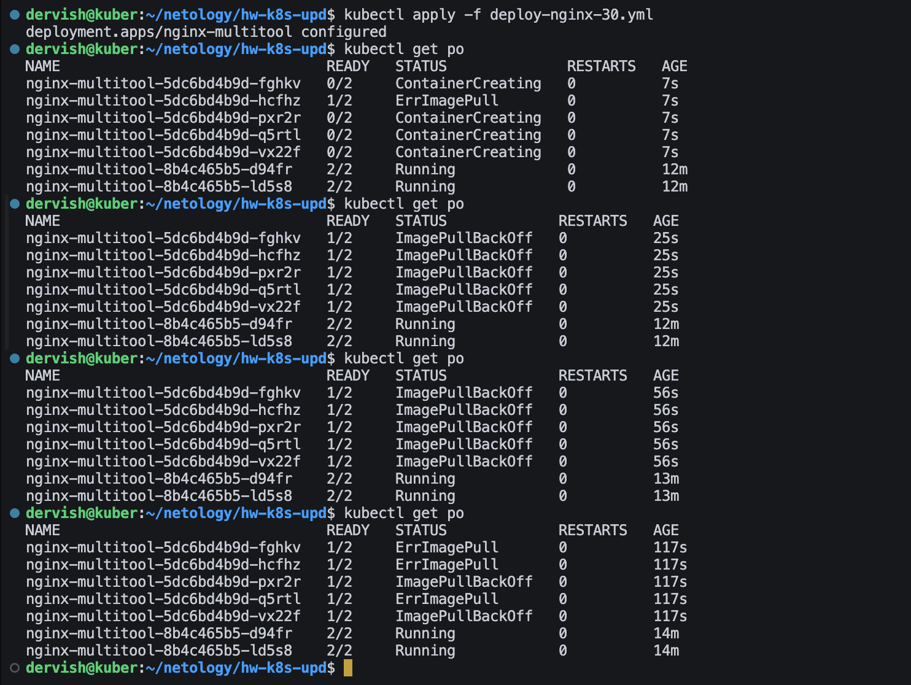
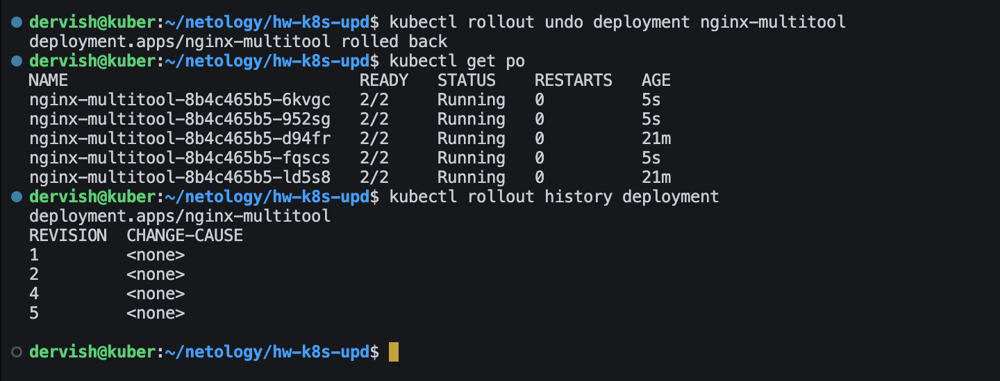

# Домашнее задание к занятию «Обновление приложений»

## Цель задания

Выбрать и настроить стратегию обновления приложения.

## Чеклист готовности к домашнему заданию

Кластер K8s.

## Задание 1. Выбрать стратегию обновления приложения и описать ваш выбор

1. Имеется приложение, состоящее из нескольких реплик, которое требуется обновить.
2. Ресурсы, выделенные для приложения, ограничены, и нет возможности их увеличить.
3. Запас по ресурсам в менее загруженный момент времени составляет 20%.
4. Обновление мажорное, новые версии приложения не умеют работать со старыми.
5. Вам нужно объяснить свой выбор стратегии обновления приложения.

>Ответ: одним из вариантов может быть стратегия Rolling Update. Так как есть ограничения по ресурсам, то необходимо использовать параметры maxSurge: 20% и maxUnavailable: 20%.
>maxSurge: 20% даст возможность дополнительно запустить 20% реплик с новой версией приложения сверх имеющегося количества. Например, если у меня 5 реплик старого приложения, то maxSurge: 20% даст возможность запустить одну реплику приложения с новой версией.
>maxUnavailable: 20% даст возможность выключить 20% реплик со старой версией приложения во время обновления.
>Но, учитывая, что обновление мажорное и новые версии приложения не умеют работать со старыми, можно увеличить параметр maxUnavailable до 100%. Это позволит удалить все старые реплики при запуске новой.
>Если же необходимых ресурсов для запуска новой версии не достаточно, то можно применить стратегию обновления Recreate. При этой стратегии старые поды удалятся одномоментно, а новая версия приложения станет доступной после поднятия подов с новой версией. Это обновление с простоем, но в любом случае подобного рода обновления следует делать во время наименьшей загрузки ресурсов от запросов пользователей.

## Задание 2. Обновить приложение

1. Создать deployment приложения с контейнерами nginx и multitool. Версию nginx взять 1.19. Количество реплик — 5.

>[deploy-nginx-19.yml](./deploy-nginx-19.yml)

2. Обновить версию nginx в приложении до версии 1.20, сократив время обновления до минимума. Приложение должно быть доступно.

>[deploy-nginx-20.yml](./deploy-nginx-20.yml)

3. Попытаться обновить nginx до версии 1.28, приложение должно оставаться доступным.

>[deploy-nginx-28.yml](./deploy-nginx-28.yml)

>Поскольку nginx v.1.28 уже существует, он также благополучно запустился, поэтому попробуем запустить версию, которой на данный момент точно нет и посмотрим на результат.

>[deploy-nginx-30.yml](./deploy-nginx-30.yml)

>Несмотря на ошибки обновления приложение остается доступным, поскольку имеется две рабочие реплики предыдущей версии.

4. Откатиться после неудачного обновления.

>После запуска процедуры отката не рабочие поды были удалены, а вместо них были запущены поды последней удачной конфигурации, в нашем случае - это версия 1.28 nginx
